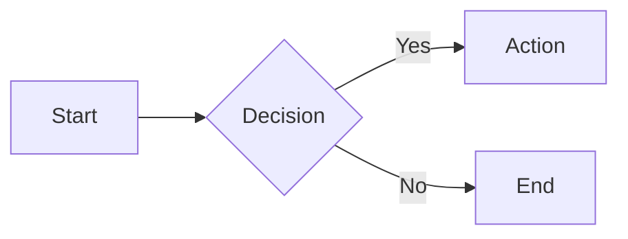

# Dynamic Markdown Site

<!-- Last updated: 2026-07-13 -->

A type-safe, high-performance Go web server that turns any directory of markdown files into a beautiful, navigable website — with syntax highlighting, full-text search, diagram rendering, live reload, cloud storage support, and caching built in.

Point it at a folder of `.md` files (or an S3/GCS bucket) and get a fully functional documentation site in seconds. No static-site generator, no build step, no database.

## Highlights

- **Zero config** — drop markdown files in a directory, run the binary
- **Cloud-native storage** — filesystem, [S3](https://aws.amazon.com/s3/), [GCS](https://cloud.google.com/storage), or Azure Blob via [gocloud.dev](https://gocloud.dev)
- **Syntax highlighting** — [Chroma](https://github.com/alecthomas/chroma) with Monokai theme for 200+ languages
- **Full-text search** — case-insensitive search with relevance scoring and highlighted snippets
- **Diagrams** — server-side [D2](https://d2lang.com/) rendering and client-side [Mermaid](https://mermaid.js.org/)
- **Live reload** — browser auto-reloads on file changes via SSE (dev mode)
- **Admonition blocks** — GitHub-style `> [!NOTE]`, `> [!WARNING]`, and 4 more alert types
- **Table of contents** — auto-generated from headings with anchor links and reading time estimates
- **Frontmatter** — YAML metadata (title, description, author, tags, draft)
- **Type-safe templates** — [Templ](https://templ.guide/) for compile-time HTML safety
- **Caching** — [Otter](https://github.com/maypok86/otter) auto-tuning cache for HTML responses
- **Security-first** — path traversal prevention at the type level, rate limiting, security headers, distroless container
- **Docker-ready** — distroless runtime, non-root user, multi-arch (amd64 + arm64), built-in healthcheck
- **Graceful shutdown** — SIGINT/SIGTERM handling with 30s drain timeout

## Quick Start

```bash
git clone https://github.com/LarsArtmann/dynamic-markdown-site
cd dynamic-markdown-site

# Run in development mode (live reload, no caching)
go run ./cmd/dynamic-markdown-site -dev -root ./content
```

Open [http://localhost:8080](http://localhost:8080) — your markdown files are now a website.

### From S3 / GCS

```bash
# Serve directly from an S3 bucket
dynamic-markdown-site -storage-url s3://my-bucket/docs

# Or Google Cloud Storage
dynamic-markdown-site -storage-url gs://my-bucket/docs
```

## Installation

### Pre-built Binary

Download the latest release from [GitHub Releases](https://github.com/LarsArtmann/dynamic-markdown-site/releases).

### Docker

```bash
docker run -p 8080:8080 -v ./content:/content ghcr.io/larsartmann/dynamic-markdown-site:latest
```

### Build from Source

```bash
# Requires Go 1.26+ and the Templ CLI
go install github.com/a-h/templ/cmd/templ@latest
go build -o dynamic-markdown-site ./cmd/dynamic-markdown-site
```

### Nix

```bash
NIXPKGS_ALLOW_UNFREE=1 nix run github:LarsArtmann/dynamic-markdown-site --impure
```

## Usage

### CLI Flags

```bash
dynamic-markdown-site [flags]
```

| Flag           | Default | Description                                                           |
| -------------- | ------- | --------------------------------------------------------------------- |
| `-port`        | `8080`  | HTTP server port                                                      |
| `-root`        | `.`     | Root directory containing markdown files (filesystem mode)            |
| `-storage-url` |         | Blob storage URL: `file://`, `s3://`, `gs://`, `azblob://`            |
| `-log-level`   | `info`  | Log level: `debug`, `info`, `warn`, `error`                           |
| `-cache`       | `true`  | Enable HTML response caching                                          |
| `-dev`         | `false` | Development mode: disables cache, enables file watching & live reload |
| `-timeout`     | `30s`   | HTTP request timeout                                                  |

### Environment Variables

All flags can be set via environment variables with the `DYNAMIC_MARKDOWN_` prefix:

```bash
DYNAMIC_MARKDOWN_PORT=3000
DYNAMIC_MARKDOWN_ROOT=./docs
DYNAMIC_MARKDOWN_STORAGE_URL=s3://my-bucket/docs
DYNAMIC_MARKDOWN_LOG_LEVEL=debug
DYNAMIC_MARKDOWN_CACHE=false
DYNAMIC_MARKDOWN_DEV=true
DYNAMIC_MARKDOWN_TIMEOUT=60s
DYNAMIC_MARKDOWN_SITE_NAME="My Wiki"
```

## Markdown Features

### Extensions

Full [Goldmark](https://github.com/yuin/goldmark) pipeline with all extensions enabled:

| Extension        | Syntax                               |
| ---------------- | ------------------------------------ |
| Tables           | Standard GFM tables                  |
| Strikethrough    | `~~deleted~~`                        |
| Task lists       | `- [ ]` / `- [x]`                    |
| Definition lists | Term followed by `: definition`      |
| Footnotes        | `[^1]` with `[^1]: text`             |
| Auto headings    | Slugged heading IDs for anchor links |
| Linkify          | Auto-link bare URLs                  |
| Typographer      | Smart quotes, dashes, ellipses       |
| Admonitions      | GitHub-style `> [!NOTE]` alerts      |

### Frontmatter

Markdown files support YAML frontmatter:

```yaml
---
title: "Page Title"
description: "Page description"
author: "Author Name"
tags: ["go", "markdown"]
draft: false
---
# Your content here
```

Files with `draft: true` are excluded from the site.

### Diagrams

Embed diagrams directly in markdown using fenced code blocks:

**D2** (server-side SVG rendering):

````markdown
```d2
x -> y: hello
y -> z: world
```
````

**Mermaid** (client-side via Mermaid.js):

````markdown

````

## API

| Endpoint           | Method   | Description                                        |
| ------------------ | -------- | -------------------------------------------------- |
| `/`                | GET      | Root directory listing                             |
| `/*path`           | GET      | Markdown file or directory listing                 |
| `/health`          | GET      | Health check with dependency status (JSON)         |
| `/refresh`         | GET/POST | Refresh content from source (rate limited: 10/min) |
| `/search`          | GET      | Full-text search (`?q=query`)                      |
| `/sitemap.xml`     | GET      | XML sitemap for search engines                     |
| `/robots.txt`      | GET      | Robots file for crawlers                           |
| `/metrics`         | GET      | Prometheus-format metrics                          |
| `/cache/stats`     | GET      | Cache hit/miss statistics (JSON)                   |
| `/static/*path`    | GET      | Static assets (CSS, favicon)                       |
| `/api/live-reload` | GET      | SSE endpoint for live reload (dev mode only)       |

## Docker

The image uses Google's distroless runtime — no shell, no package manager, minimal attack surface:

```dockerfile
FROM gcr.io/distroless/static-debian13:nonroot
COPY dynamic-markdown-site /app/dynamic-markdown-site
USER 65532:65532
HEALTHCHECK \
  CMD ["/app/dynamic-markdown-site", "healthcheck", "--addr", "localhost:8080"]
ENTRYPOINT ["/app/dynamic-markdown-site"]
CMD ["-root", "/content", "-port", "8080", "-cache"]
```

Multi-arch images (amd64, arm64) are published to GitHub Container Registry:

```bash
# Pull the latest image
docker pull ghcr.io/larsartmann/dynamic-markdown-site:latest

# Run with local content
docker run -p 8080:8080 -v ./content:/content ghcr.io/larsartmann/dynamic-markdown-site:latest

# Run with S3 backend
docker run -p 8080:8080 \
  -e AWS_ACCESS_KEY_ID=$AWS_ACCESS_KEY_ID \
  -e AWS_SECRET_ACCESS_KEY=$AWS_SECRET_ACCESS_KEY \
  ghcr.io/larsartmann/dynamic-markdown-site:latest \
  -storage-url s3://my-bucket/docs
```

Since distroless has no shell or `curl`, the binary implements its own `healthcheck` subcommand that probes `/health` and exits 0 on a 200 response.

## Continuous Integration

GitHub Actions runs three workflows:

| Workflow      | Purpose                                                                          | Triggers                                   |
| ------------- | -------------------------------------------------------------------------------- | ------------------------------------------ |
| `test.yml`    | `go test -race -cover`, 75% coverage floor, `golangci-lint`, `templ` drift check | Go/Templ/go.mod changes                    |
| `docker.yml`  | Multi-arch Docker build & push to GHCR, Trivy scan, artifact attestation         | Go/Templ/Dockerfile changes, `v*.*.*` tags |
| `release.yml` | GoReleaser: cross-compile, cosign signing, SBOM, Homebrew, Nix, Scoop            | `v*.*.*` tags                              |

## Development

### Prerequisites

- Go 1.26+
- [Templ](https://templ.guide/) CLI (`go install github.com/a-h/templ/cmd/templ@latest`)
- [golangci-lint](https://golangci-lint.run/) (for linting)
- [Nix](https://nixos.org/) (optional, for reproducible builds)

### Workflow

```bash
# Enter the Nix dev shell (Go, golangci-lint, gopls, templ)
NIXPKGS_ALLOW_UNFREE=1 nix develop --impure

# Or use Go directly
go mod tidy

# Generate Templ templates (required after editing .templ files)
templ generate

# Run tests
go test ./... -race -cover

# Run linter
golangci-lint run ./...

# Run in dev mode
go run ./cmd/dynamic-markdown-site -dev -root ./content
```

## Architecture

```
cmd/dynamic-markdown-site/
├── main.go              # Entry point, graceful shutdown
├── healthcheck.go       # Docker HEALTHCHECK subcommand
└── watcher.go           # File system watcher (dev mode)

internal/
├── cache/               # Otter-based HTML response caching
├── config/              # CLI flags, env vars, blob storage config
├── container/           # Dependency injection (samber/do/v2)
├── content/             # Repository pattern (blob + filesystem + in-memory)
│   ├── blob.go          # gocloud.dev-backed repository (S3, GCS, Azure, file)
│   ├── filesystem.go    # Disk-backed content repository
│   ├── memory.go        # In-memory repository (for testing)
│   └── search.go        # Full-text search with scoring
├── domain/              # Core types (URLPath, DirectoryNode, FileNode, Frontmatter)
├── renderer/            # Markdown -> HTML (Goldmark + Chroma + diagrams)
│   ├── markdown.go      # Goldmark renderer with all extensions
│   ├── diagram_extension.go  # D2 & Mermaid goldmark extension
│   ├── admonition_extension.go  # GitHub-style alert blocks
│   └── diagrams.go      # D2 server-side & Mermaid client-side rendering
└── server/              # HTTP layer
    ├── handlers.go      # Route handlers (net/http, Go 1.22+ method routing)
    ├── livereload.go    # SSE-based live reload
    ├── ratelimit.go     # Per-IP rate limiting
    ├── metrics.go       # Prometheus-format metrics
    ├── sitemap.go       # XML sitemap generation
    ├── render.go        # Template rendering bridge
    └── static/          # Embedded CSS, favicon

templates/
└── layout.templ         # Templ templates (layout, directory, file, search, error views)
```

### Key Design Decisions

- **Standard `net/http`** — Go 1.22+ method-based routing. No web framework overhead.
- **Repository pattern** — content access through a `Repository` interface, enabling filesystem, blob storage, or in-memory implementations
- **Domain types** — `URLPath` prevents directory traversal at the type level; `HTML` distinguishes pre-escaped content from plain text
- **Composition over inheritance** — small, focused types composed together rather than deep hierarchies
- **Compile-time safety** — Templ templates produce Go code, catching HTML errors at build time
- **Embedded assets** — CSS and favicon embedded via `//go:embed`; single static binary, zero runtime file dependencies

## Tech Stack

| Component            | Library                                                     |
| -------------------- | ----------------------------------------------------------- |
| HTTP server          | Go standard library `net/http` (1.22+ method routing)       |
| Markdown             | [Goldmark](https://github.com/yuin/goldmark)                |
| Syntax highlighting  | [Chroma](https://github.com/alecthomas/chroma)              |
| Templates            | [Templ](https://templ.guide/)                               |
| Dependency injection | [samber/do/v2](https://github.com/samber/do)                |
| Blob storage         | [gocloud.dev](https://gocloud.dev) (S3, GCS, Azure, file)   |
| Caching              | [Otter](https://github.com/maypok86/otter)                  |
| D2 diagrams          | [d2](https://d2lang.com/)                                   |
| Logging              | [charm.land/log](https://github.com/charmbracelet/log)      |
| Error handling       | [cockroachdb/errors](https://github.com/cockroachdb/errors) |

## License

Proprietary — see [LICENSE](LICENSE) for details.
