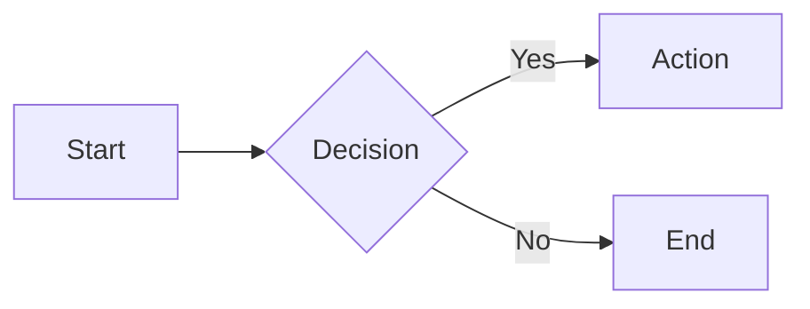

# Dynamic Markdown Site

<!-- Last updated: 2026-06-13 -->

A type-safe, high-performance Go web server that converts a directory of markdown files into a beautiful, navigable website — with syntax highlighting, full-text search, diagram rendering, live reload, and caching built in.

Point it at any folder of `.md` files and get a fully functional site in seconds.

## Highlights

- **Zero config** — drop markdown files in a directory, run the server
- **Syntax highlighting** — [Chroma](https://github.com/alecthomas/chroma) with Monokai theme for 200+ languages
- **Full-text search** — case-insensitive search with relevance scoring and highlighted results
- **Diagrams** — server-side [D2](https://d2lang.com/) rendering and client-side [Mermaid](https://mermaid.js.org/)
- **Live reload** — browser auto-reloads on file changes via SSE (dev mode)
- **Table of contents** — auto-generated from headings with anchor links
- **Frontmatter** — YAML metadata support (title, description, author, tags, draft)
- **Type-safe templates** — [Templ](https://templ.guide/) for compile-time HTML safety
- **Caching** — [Otter](https://github.com/maypok86/otter) auto-tuning cache for HTML responses
- **Docker-ready** — multi-stage build, distroless runtime, non-root user
- **Graceful shutdown** — SIGINT/SIGTERM handling with 30s drain timeout

## Quick Start

```bash
git clone https://github.com/larsartmann/dynamic-markdown-site
cd dynamic-markdown-site

# Run in development mode (live reload, no caching)
go run ./cmd/dynamic-markdown-site -dev -root ./content
```

Open [http://localhost:8080](http://localhost:8080) — your markdown files are now a website.

## Usage

### CLI Flags

```bash
dynamic-markdown-site [flags]
```

| Flag         | Default | Description                                                           |
| ------------ | ------- | --------------------------------------------------------------------- |
| `-port`      | `8080`  | HTTP server port                                                      |
| `-root`      | `.`     | Root directory containing markdown files                              |
| `-log-level` | `info`  | Log level: `debug`, `info`, `warn`, `error`                           |
| `-cache`     | `true`  | Enable HTML response caching                                          |
| `-dev`       | `false` | Development mode: disables cache, enables file watching & live reload |
| `-timeout`   | `30s`   | HTTP request timeout                                                  |

### Environment Variables

All flags can be set via environment variables with the `DYNAMIC_MARKDOWN_` prefix:

```bash
DYNAMIC_MARKDOWN_PORT=3000
DYNAMIC_MARKDOWN_ROOT=./docs
DYNAMIC_MARKDOWN_LOG_LEVEL=debug
DYNAMIC_MARKDOWN_CACHE=false
DYNAMIC_MARKDOWN_DEV=true
DYNAMIC_MARKDOWN_TIMEOUT=60s
```

### Just Commands

A [Just](https://github.com/casey/just) file is included for common tasks:

```bash
just build        # Build binary
just run-dev      # Run in development mode
just test         # Run tests with coverage
just test-v       # Verbose test output
just lint         # Run golangci-lint
just generate     # Generate Templ templates
just bench        # Run benchmarks
just clean        # Remove build artifacts
just install-local # Install with go install
```

## Markdown Features

### Extensions

All [Goldmark extensions](https://github.com/yuin/goldmark) are enabled:

| Extension        | Syntax                               |
| ---------------- | ------------------------------------ |
| Tables           | Standard GFM tables                  |
| Strikethrough    | `~~deleted~~`                        |
| Task lists       | `- [ ]` / `- [x]`                    |
| Definition lists | Term followed by `: definition`      |
| Footnotes        | `[^1]` with `[^1]: text`             |
| Auto headings    | Slugged heading IDs for anchor links |
| Linkify          | Auto-link bare URLs                  |
| Typographer      | Smart quotes, dashes, ellipses       |

### Frontmatter

Markdown files support YAML frontmatter:

```yaml
---
title: "Page Title"
description: "Page description"
author: "Author Name"
tags: ["go", "markdown"]
draft: false
---
# Your content here
```

Files with `draft: true` are excluded from the site.

### Diagrams

Embed diagrams directly in markdown using fenced code blocks:

**D2** (server-side SVG rendering):

````markdown
```d2
x -> y: hello
y -> z: world
```
````

**Mermaid** (client-side via Mermaid.js):

````markdown

````

## API

| Endpoint           | Method   | Description                                         |
| ------------------ | -------- | --------------------------------------------------- |
| `/`                | GET      | Root directory listing                              |
| `/*path`           | GET      | Markdown file or directory listing                  |
| `/health`          | GET      | Health check (`200 OK`)                             |
| `/refresh`         | GET/POST | Refresh content from disk (rate limited: 10/min/IP) |
| `/search`          | GET      | Full-text search (`?q=query`)                       |
| `/static/*path`    | GET      | Static assets (CSS, favicon)                        |
| `/api/live-reload` | GET      | SSE endpoint for live reload (dev mode only)        |

## Docker

Build and run with Docker:

```bash
# Build
docker build -t dynamic-markdown-site .

# Run (mount your markdown content)
docker run -p 8080:8080 -v ./content:/content dynamic-markdown-site
```

The image uses a multi-stage build:

- **Builder:** `golang:1.26-alpine` with static binary compilation
- **Runtime:** `distroless/static-debian13` running as `nonroot` (UID 65532)

## Development

### Prerequisites

- Go 1.26+
- [Templ](https://templ.guide/) CLI (`go install github.com/a-h/templ/cmd/templ@latest`)
- [golangci-lint](https://golangci-lint.run/) (for linting)
- [Just](https://github.com/casey/just) (optional, for task runner)

### Workflow

```bash
# Install dependencies
go mod tidy

# Generate Templ templates (required after editing .templ files)
templ generate

# Run tests
go test ./... -cover

# Run linter (~75 linters configured in .golangci.yml)
golangci-lint run ./...

# Run benchmarks
go test ./... -bench=. -benchmem

# Run in dev mode
go run ./cmd/dynamic-markdown-site -dev -root ./content
```

## Architecture

```
cmd/dynamic-markdown-site/
├── main.go              # Entry point, graceful shutdown
└── watcher.go           # File system watcher (dev mode)

internal/
├── cache/               # Otter-based HTML response caching
├── config/              # CLI flags & environment configuration
├── container/           # Dependency injection (samber/do/v2)
├── content/             # Repository pattern (filesystem + in-memory)
│   ├── filesystem.go    # Disk-backed content repository
│   ├── memory.go        # In-memory repository (for testing)
│   └── search.go        # Full-text search with scoring
├── domain/              # Core types (URLPath, DirectoryNode, FileNode, Frontmatter)
├── renderer/            # Markdown → HTML (Goldmark + Chroma + diagrams)
│   ├── markdown.go      # Goldmark renderer with all extensions
│   ├── diagram_extension.go  # D2 & Mermaid goldmark extension
│   └── diagrams.go      # D2 server-side & Mermaid client-side rendering
└── server/              # HTTP layer
    ├── handlers.go      # Route handlers
    ├── livereload.go    # SSE-based live reload
    ├── ratelimit.go     # Per-IP rate limiting
    ├── render.go        # Template rendering bridge
    └── static/          # CSS, favicon

templates/
└── layout.templ         # Templ templates (layout, directory, file, search, error views)

pkg/
└── errors/              # Shared error utilities
```

### Key Design Decisions

- **Repository pattern** — content access through a `Repository` interface, enabling filesystem or in-memory implementations
- **Domain types** — `URLPath` prevents directory traversal at the type level; `HTML` distinguishes pre-escaped content from plain text
- **Composition over inheritance** — small, focused types composed together rather than deep hierarchies
- **Compile-time safety** — Templ templates produce Go code, catching HTML errors at build time

## Tech Stack

| Component            | Library                                                     |
| -------------------- | ----------------------------------------------------------- |
| HTTP framework       | [Gin](https://gin-gonic.com/)                               |
| Markdown             | [Goldmark](https://github.com/yuin/goldmark)                |
| Syntax highlighting  | [Chroma](https://github.com/alecthomas/chroma)              |
| Templates            | [Templ](https://templ.guide/)                               |
| Dependency injection | [samber/do/v2](https://github.com/samber/do)                |
| Caching              | [Otter](https://github.com/maypok86/otter)                  |
| D2 diagrams          | [d2](https://d2lang.com/)                                   |
| Logging              | [charm.land/log](https://github.com/charmbracelet/log)      |
| Error handling       | [cockroachdb/errors](https://github.com/cockroachdb/errors) |

## License

Proprietary — see [LICENSE](LICENSE) for details.
