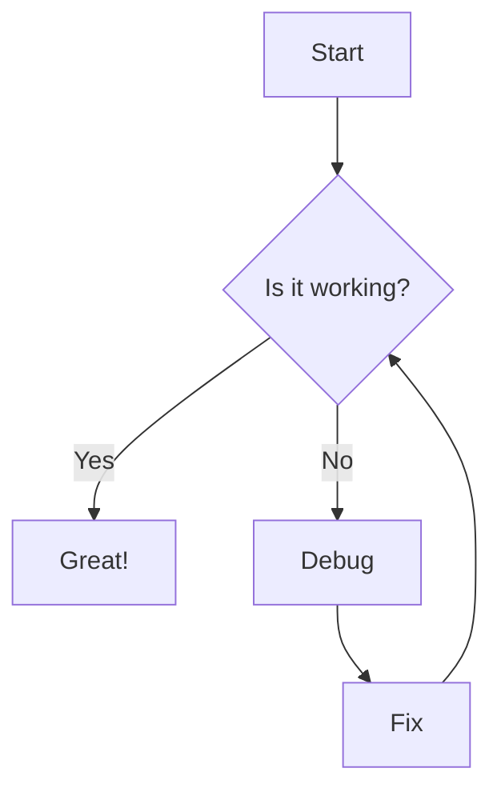
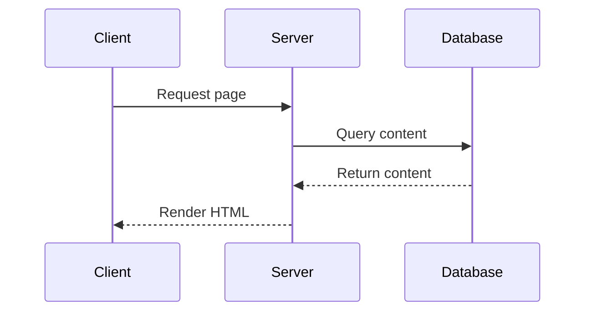

# Diagram Examples

This page demonstrates D2 and Mermaid diagram support.

## D2 Diagram

```d2
direction: right

A: {
  shape: circle
  label: Start
}

B: {
  shape: rectangle
  label: Process
}

C: {
  shape: diamond
  label: Decision
}

A -> B
B -> C
```

## Mermaid Flowchart



## Mermaid Sequence Diagram


