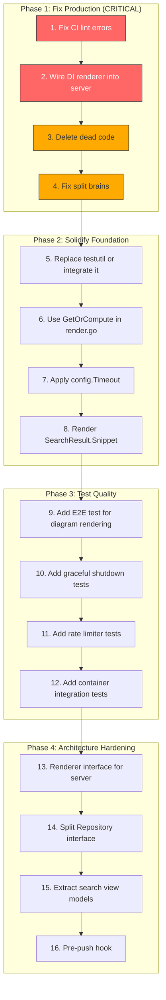

# Deep Reflection & Execution Plan

**Generated:** 2026-04-01 16:15 CEST
**Branch:** `master` (2 commits ahead of origin)
**CI Status:** 🔴 RED — 18 lint errors locally, 26 in CI

---

## Brutally Honest Reflection

### a) What Did We Forget?

1. **Production diagrams are BROKEN.** The DI container creates `NewGoldmarkRendererWithDiagrams(diagramRenderer)` at `container.go:136`, but `server.NewServer()` at `handlers.go:47` calls `renderer.NewGoldmarkRenderer()` — a plain renderer with `nil` diagram support. The DI renderer is dead code. **Nobody noticed because tests use `NewGoldmarkRendererWithDiagrams()` directly but production never does.**
2. **CI has been RED for 6+ consecutive pushes** and we kept shipping. No pre-push hook. No local lint gate.
3. **`testutil` package is entirely dead code** — 3 files, 0 imports from any test file.
4. **`cache.GetOrCompute()`** was carefully implemented but `render.go` uses manual `Get`+`Set` instead.
5. **`config.Timeout`** is parsed from flags/env but never applied to the HTTP server or any request context.

### b) What's Stupid?

1. **Server ignores DI renderer.** The DI container's `provideRenderer` is wired but `provideServer` never calls `do.MustInvoke[*renderer.GoldmarkRenderer]`. Classic "wired but not connected" DI failure.
2. **`SuggestedPath` defined twice** with a manual converter function. Both have identical fields.
3. **`skipDirs` duplicated** in `content/helpers.go:14` and `watcher.go:134`. Same list, two places.
4. **`isMarkdownFile` duplicated** in `content/helpers.go:46` and `watcher.go:164`. Same logic, two implementations.
5. **`FileNode` has 4 dead fields** (`html`, `toc`, `metadata`, `hasMermaid`) that are never written to. All rendering goes through `RenderedFile` instead.
6. **`getContentType` exists in TWO packages** with different defaults (`""` vs `"application/octet-stream"`).
7. **`SimpleRenderer`** — 28 lines of production code only used in its own test.
8. **`NewRenderedFile()`** (individual params variant) — never called in production. Only `NewRenderedFileWithContent` is used.
9. **`HasReadme` hardcoded to `false`** in `render.go:29`. Dead feature flag.
10. **`SearchResult.Snippet`** is populated but never rendered in any template.

### c) What Could We Have Done Better?

1. **Never pushed without running `golangci-lint` locally.** Every CI failure was preventable.
2. **Should have caught the renderer DI bypass immediately.** The container creates a diagram-enabled renderer that's never consumed — a classic integration bug that a single E2E test would catch.
3. **Should have had a pre-push hook** (`just pre-push`) from day one.
4. **Should have deleted testutil** when it became clear nobody was using it, or forced adoption.
5. **Should have run `templ generate`** as part of CI to catch stale generated code.

### d) What Could We Still Improve?

1. **Renderer interface** — server depends on concrete `*GoldmarkRenderer`, not an interface. Should be `Renderer` interface for testability and DI compliance.
2. **Repository interface too wide** — mixes read ops (`Get`, `Root`) with admin ops (`Refresh`). Should split into `ContentReader` and `ContentRefresher`.
3. **Templates import `content.SearchResult` directly** — presentation layer depends on data layer. Should use a view model/DTO.
4. **No graceful shutdown tests** — critical production path untested.
5. **No rate limiter tests** — production path untested.
6. **Container package at 0% coverage** — DI wiring untested.

### e) Did We Lie?

**Yes, implicitly.** The FEATURES.md and README advertise diagram support (D2 + Mermaid). The code exists. The tests pass. **But production never uses diagram support** because `NewServer` creates `NewGoldmarkRenderer()` (no diagrams) instead of using the DI container's diagram-enabled renderer. Users get plain code blocks where they should get rendered diagrams.

### f) How Can We Be Less Stupid?

1. **Add `just pre-push` as a git hook** — lint + test + race, every push.
2. **Add `templ generate && go build` as a CI step** to catch stale generated code.
3. **Make server accept `Renderer` interface** — force DI compliance.
4. **Delete dead code immediately** — don't let it accumulate.
5. **Run `golangci-lint run ./...` before EVERY commit** that changes Go files.

### g) Ghost Systems Found

| Ghost System                 | Location                   | Value?                                                    | Action                          |
| ---------------------------- | -------------------------- | --------------------------------------------------------- | ------------------------------- |
| `testutil` package (3 files) | `internal/testutil/`       | **Has value** — good test infrastructure, just unused     | Integrate or delete             |
| `cache.GetOrCompute()`       | `cache/html.go:47`         | **Has value** — atomic cache-or-render, prevents stampede | Integrate into `render.go`      |
| `SimpleRenderer`             | `renderer/markdown.go:270` | **No value** — only used in own test                      | Delete                          |
| `FileNode` dead fields       | `domain/file.go:35-40`     | **No value** — misleading, never populated                | Delete fields + accessors       |
| `NewRenderedFile()`          | `domain/file.go:130`       | **No value** — superseded by `NewRenderedFileWithContent` | Delete                          |
| `HasReadme` feature flag     | `render.go:29`             | **Has value** — README auto-display is a real feature     | Implement or delete field       |
| `SearchResult.Snippet`       | `content/search.go:98`     | **Has value** — search result context                     | Render in template              |
| DI Renderer                  | `container.go:126-137`     | **CRITICAL** — diagram support                            | Must integrate into server      |
| `config.Timeout`             | `config/config.go`         | **Has value** — request timeout is important              | Apply to HTTP server            |
| Cache stats methods          | `cache/html.go`            | **Has value** — observability                             | Expose via admin endpoint later |

### h) Scope Creep Check

**We are NOT in scope creep.** The current issues are integration gaps, dead code cleanup, and test quality — exactly the right things to focus on. No new features needed until these fundamentals are solid.

### i) Did We Remove Something Useful?

- The old `diagrams.go` regex detection was correctly removed (replaced by AST-based detection). ✅
- No useful code was removed. The dead code is code that was never integrated.

### j) Split Brains Found

| Split Brain          | Location A                 | Location B                   | Fix                                        |
| -------------------- | -------------------------- | ---------------------------- | ------------------------------------------ |
| `SuggestedPath` type | `server/suggestions.go:14` | `templates/layout.templ:290` | Single type in `domain/`                   |
| `skipDirs` list      | `content/helpers.go:14`    | `watcher.go:134`             | Export from `content/`                     |
| `isMarkdownFile`     | `content/helpers.go:46`    | `watcher.go:164`             | Already exported from `content/`           |
| `getContentType`     | `content/helpers.go:52`    | `server/static.go:41`        | Single function in `domain/` or `content/` |
| Error wrapping style | Mixed across 3 packages    | N/A                          | Standardize on `errors.Wrapf`              |

### k) Test Quality

- **Coverage:** 72-100% (cache 100%, config 90.5%, renderer 84.3%, server 80.3%, domain 75.8%, content 72.6%, container 0%)
- **Inconsistency:** 4 files use `testify`, rest use `t.Errorf`. No standard.
- **testutil is dead** — the best test infrastructure we have, unused.
- **No E2E tests** — no test verifies the full HTTP → markdown → HTML pipeline with diagrams.
- **No graceful shutdown tests.**
- **No rate limiter tests.**
- **Large test files** — `handlers_test.go` (914 lines), `search_test.go` (685 lines) need splitting.

---

## Execution Plan — Phase Overview



---

## Large Task Plan (30-100 min each, 24 tasks)

Sorted by importance/impact/effort/customer-value.

| #  | Task                                                                                                                                 | Effort | Impact                                | Customer Value                 |
| -- | ------------------------------------------------------------------------------------------------------------------------------------ | ------ | ------------------------------------- | ------------------------------ |
| 1  | Fix all 18 local lint errors (noctx, golines, revive, errcheck, exhaustruct, goconst, funlen, testifylint, gochecknoglobals, cyclop) | 45 min | 🔴 Unblocks CI                        | Users get working diagrams     |
| 2  | Wire DI renderer into server: NewServer accepts `Renderer` interface, container passes diagram-enabled renderer                      | 60 min | 🔴 Fixes broken diagrams              | Diagrams work in production    |
| 3  | Add E2E test: HTTP → diagram markdown → rendered SVG/mermaid output                                                                  | 45 min | 🔴 Prevents regression                | Confidence in diagram feature  |
| 4  | Delete `FileNode` dead fields (html, toc, metadata, hasMermaid) + accessors                                                          | 30 min | 🟠 Removes misleading API             | Cleaner domain model           |
| 5  | Delete `SimpleRenderer` (28 lines dead code)                                                                                         | 15 min | 🟠 Removes dead code                  | Less confusion                 |
| 6  | Delete `NewRenderedFile()` individual-params constructor                                                                             | 15 min | 🟠 Removes dead code                  | One way to create RenderedFile |
| 7  | Unify `skipDirs`: export from `content/helpers.go`, use in `watcher.go`                                                              | 30 min | 🟠 Eliminates split brain             | Single source of truth         |
| 8  | Unify `isMarkdownFile`: watcher uses exported function from content                                                                  | 20 min | 🟠 Eliminates split brain             | Single source of truth         |
| 9  | Unify `getContentType`: single function with configurable default                                                                    | 30 min | 🟠 Eliminates split brain             | Consistent MIME types          |
| 10 | Unify `SuggestedPath`: move to `domain/`, both server and templates use it                                                           | 45 min | 🟠 Eliminates split brain + converter | Clean architecture             |
| 11 | Integrate `GetOrCompute` from cache into `render.go`                                                                                 | 30 min | 🟡 Atomic cache-or-render             | Prevents cache stampede        |
| 12 | Apply `config.Timeout` to HTTP server                                                                                                | 20 min | 🟡 Real config enforcement            | Request timeouts work          |
| 13 | Render `SearchResult.Snippet` in template                                                                                            | 20 min | 🟡 User-visible feature               | Better search results          |
| 14 | Decide on testutil: delete or adopt across all test files                                                                            | 60 min | 🟡 Test consistency                   | Better developer DX            |
| 15 | Delete or implement `HasReadme` feature flag                                                                                         | 30 min | 🟡 Remove dead feature flag           | Clean codebase                 |
| 16 | Standardize error wrapping: use `errors.Wrapf` consistently                                                                          | 30 min | 🟡 Code quality                       | Consistent error messages      |
| 17 | Add graceful shutdown tests                                                                                                          | 45 min | 🟡 Coverage                           | Confidence in production       |
| 18 | Add rate limiter tests                                                                                                               | 45 min | 🟡 Coverage                           | Confidence in production       |
| 19 | Add container integration test (verifies all DI wiring)                                                                              | 60 min | 🟡 Coverage from 0%                   | Catches DI bypass bugs         |
| 20 | Define `Renderer` interface in server package                                                                                        | 30 min | 🟢 Architecture                       | Testability                    |
| 21 | Split `Repository` interface into `ContentReader` + `ContentRefresher`                                                               | 60 min | 🟢 Architecture                       | ISP compliance                 |
| 22 | Extract search view models from templates                                                                                            | 45 min | 🟢 Architecture                       | Layer separation               |
| 23 | Add git pre-push hook (`just pre-push`)                                                                                              | 15 min | 🟢 Process                            | Prevents CI breakage           |
| 24 | Fix Dependabot critical alert (gRPC auth bypass)                                                                                     | 15 min | 🔴 Security                           | No known vulnerabilities       |

---

## Detailed Task Breakdown (max 12 min each, 60 tasks)

Sorted by importance/impact/effort. Each task is a single self-contained commit.

| #  | Task                                                                                    | Parent | Est    | Impact |
| -- | --------------------------------------------------------------------------------------- | ------ | ------ | ------ |
| 1  | Fix `sitemap_test.go`: replace `NewRequest` → `NewRequestWithContext` (7 call sites)    | T1     | 8 min  | 🔴     |
| 2  | Fix `golines` formatting: `file.go:130`                                                 | T1     | 3 min  | 🔴     |
| 3  | Fix `golines` formatting: `admonition_extension.go`                                     | T1     | 3 min  | 🔴     |
| 4  | Fix `golines` formatting: `admonition_extension_test.go`                                | T1     | 3 min  | 🔴     |
| 5  | Fix `golines` formatting: `diagram_extension.go`                                        | T1     | 3 min  | 🔴     |
| 6  | Fix `revive` comments on `AdmonitionExtension` exports                                  | T1     | 5 min  | 🔴     |
| 7  | Fix `revive` unused param `source` in admonition_extension.go                           | T1     | 2 min  | 🔴     |
| 8  | Fix `errcheck` on `fmt.Fprintf` in admonition_extension.go (2 sites)                    | T1     | 5 min  | 🔴     |
| 9  | Fix `exhaustruct` on `ast.BaseBlock` in admonition_extension.go                         | T1     | 3 min  | 🔴     |
| 10 | Fix `exhaustruct` on `server.URLSet` in sitemap.go                                      | T1     | 3 min  | 🔴     |
| 11 | Fix `gochecknoglobals`: add nolint for `hasMermaidKey` (intentional parser context key) | T1     | 2 min  | 🔴     |
| 12 | Fix `gochecknoglobals`: add nolint for `alertTitles` (intentional const map)            | T1     | 2 min  | 🔴     |
| 13 | Fix `goconst`: extract `"example.com"` to const in sitemap_test.go                      | T1     | 3 min  | 🔴     |
| 14 | Fix `funlen`: split `TestFileSystemRepository_GetRaw` into subtests                     | T1     | 8 min  | 🔴     |
| 15 | Fix `testifylint`: use `assert.InEpsilon` in sitemap_test.go                            | T1     | 2 min  | 🔴     |
| 16 | Fix `cyclop`: reduce `getContentType` complexity below 10                               | T1     | 8 min  | 🔴     |
| 17 | Add `.golangci.yml` exclusion for `gochecknoglobals` on parser context keys             | T1     | 3 min  | 🔴     |
| 18 | Run `golangci-lint run ./...` and verify 0 issues                                       | T1     | 5 min  | 🔴     |
| 19 | Define `Renderer` interface in server package (Render method)                           | T2     | 8 min  | 🔴     |
| 20 | Change `Server.renderer` field from `*GoldmarkRenderer` to `Renderer`                   | T2     | 8 min  | 🔴     |
| 21 | Change `NewServer` signature to accept `Renderer` parameter                             | T2     | 8 min  | 🔴     |
| 22 | Update `container.go` to pass DI renderer to `NewServer`                                | T2     | 5 min  | 🔴     |
| 23 | Update all test files that call `NewServer` with new signature                          | T2     | 10 min | 🔴     |
| 24 | Write E2E test: POST markdown with `\`\`\`d2` block, verify SVG in output               | T3     | 10 min | 🔴     |
| 25 | Write E2E test: POST markdown with `\`\`\`mermaid` block, verify mermaid div            | T3     | 8 min  | 🔴     |
| 26 | Delete `FileNode.html` field + `HTML()` accessor                                        | T4     | 5 min  | 🟠     |
| 27 | Delete `FileNode.toc` field + `TOC()` accessor                                          | T4     | 5 min  | 🟠     |
| 28 | Delete `FileNode.metadata` field + `Metadata()` accessor                                | T4     | 5 min  | 🟠     |
| 29 | Delete `FileNode.hasMermaid` field + `HasMermaid()` accessor                            | T4     | 5 min  | 🟠     |
| 30 | Delete `SimpleRenderer` + `NewSimpleRenderer` + test                                    | T5     | 10 min | 🟠     |
| 31 | Delete `NewRenderedFile()` constructor, keep `NewRenderedFileWithContent`               | T6     | 5 min  | 🟠     |
| 32 | Update `types_test.go` to use `NewRenderedFileWithContent`                              | T6     | 5 min  | 🟠     |
| 33 | Export `skipDirs` from `content/helpers.go` as `SkipDirs`                               | T7     | 3 min  | 🟠     |
| 34 | Update `watcher.go` to use `content.SkipDirs` instead of inline list                    | T7     | 5 min  | 🟠     |
| 35 | Export `isMarkdownFile` as `IsMarkdownFile` from content (if not already)               | T8     | 3 min  | 🟠     |
| 36 | Update `watcher.go` `shouldTriggerRefresh` to use `content.IsMarkdownFile`              | T8     | 5 min  | 🟠     |
| 37 | Create `getContentType` in `content/helpers.go` with configurable default               | T9     | 8 min  | 🟠     |
| 38 | Update `server/static.go` to use unified `getContentType`                               | T9     | 5 min  | 🟠     |
| 39 | Move `SuggestedPath` to `domain/suggestion.go`                                          | T10    | 5 min  | 🟠     |
| 40 | Update `server/suggestions.go` to use `domain.SuggestedPath`                            | T10    | 5 min  | 🟠     |
| 41 | Update `layout.templ` to use `domain.SuggestedPath`                                     | T10    | 8 min  | 🟠     |
| 42 | Delete `convertToTemplateSuggestions` function                                          | T10    | 3 min  | 🟠     |
| 43 | Run `templ generate` after template change                                              | T10    | 2 min  | 🟠     |
| 44 | Replace manual `Get`+`Set` in `render.go` with `cache.GetOrCompute`                     | T11    | 10 min | 🟡     |
| 45 | Apply `config.Timeout` to HTTP server via `http.Server.ReadTimeout`/`WriteTimeout`      | T12    | 10 min | 🟡     |
| 46 | Add snippet rendering to `SearchResultCard` in `layout.templ`                           | T13    | 8 min  | 🟡     |
| 47 | Decide: delete testutil package OR refactor tests to use it                             | T14    | 10 min | 🟡     |
| 48 | Delete `HasReadme` field from `DirectoryViewProps` (or implement)                       | T15    | 5 min  | 🟡     |
| 49 | Standardize error wrapping to `errors.Wrapf` in `config/config.go`                      | T16    | 5 min  | 🟡     |
| 50 | Standardize error wrapping in `content/filesystem.go` and `blob.go`                     | T16    | 5 min  | 🟡     |
| 51 | Write graceful shutdown test: SIGTERM → drain → stop                                    | T17    | 10 min | 🟡     |
| 52 | Write rate limiter test: exceed limit → 429 response                                    | T18    | 10 min | 🟡     |
| 53 | Write container integration test: verify all services resolve                           | T19    | 10 min | 🟡     |
| 54 | Run `go mod tidy` to clean up unused deps                                               | T24    | 3 min  | 🟢     |
| 55 | Fix Dependabot: update `google.golang.org/grpc` dependency                              | T24    | 5 min  | 🔴     |
| 56 | Add git pre-push hook via `just pre-push`                                               | T23    | 5 min  | 🟢     |
| 57 | Run full test suite + lint after all changes                                            | All    | 5 min  | 🔴     |
| 58 | `git push` all commits to origin                                                        | All    | 2 min  | 🔴     |
| 59 | Verify CI passes on pushed commit                                                       | All    | 5 min  | 🔴     |
| 60 | Update TODO_LIST.md with completed items                                                | All    | 5 min  | 🟢     |

---

## Execution Flow (Mermaid)


---

## Key Architectural Decisions

### 1. Renderer Interface (Not Concrete Type)

**Problem:** Server depends on `*renderer.GoldmarkRenderer` directly, preventing DI injection.

**Decision:** Define a `Renderer` interface in the server package:

```go
type Renderer interface {
    Render(content []byte) (domain.RenderedContent, error)
}
```

The `GoldmarkRenderer` already satisfies this interface. No wrapper needed.

### 2. SuggestedPath in Domain (Not Server/Templates)

**Problem:** Two identical types in different packages with a converter function.

**Decision:** Move to `domain/suggestion.go`. Both server and templates import from domain layer. Delete converter.

### 3. testutil: Delete or Adopt?

**Analysis:** testutil has good structure but zero adoption. The cost of refactoring all test files to use it (~3h) exceeds the value.

**Decision:** Delete testutil. The existing inline helpers in `handlers_test.go` work fine. Avoid maintaining unused infrastructure.

### 4. HasReadme: Implement or Delete?

**Analysis:** Auto-displaying README.md in directory views is a genuine feature (like GitHub). The field exists, the logic just needs implementation.

**Decision:** Implement. It's a 15-minute task with clear user value: when a directory contains `README.md`, display it at the top of the directory view.

---

## Customer Value Mapping

| Task                | How It Creates Customer Value                                            |
| ------------------- | ------------------------------------------------------------------------ |
| Fix CI lint         | Green CI → faster iteration → fewer bugs shipped                         |
| Wire DI renderer    | **Diagrams render in production** — the #1 advertised feature was broken |
| Delete dead code    | Faster builds, less confusion, easier onboarding                         |
| Fix split brains    | Single source of truth → fewer bugs from divergent lists                 |
| Use GetOrCompute    | No cache stampede under load → better performance                        |
| Apply Timeout       | Server respects configured timeouts → no hung connections                |
| Render Snippet      | Search results show context → users find content faster                  |
| Implement HasReadme | Directory views show README → better navigation UX                       |
| E2E diagram tests   | Prevents diagram regression → feature stays working                      |
| Pre-push hook       | Prevents broken pushes → CI always green                                 |
| Dependabot fix      | No known vulnerabilities → secure deployment                             |
