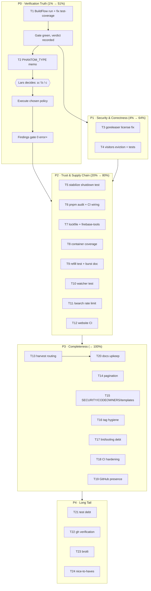

# Pareto Execution Plan — Verification Truth, Security Honesty, Test Trust

**Generated:** 2026-09-27 04:35 CEST
**Input:** `TODO_LIST.md` (20 code-verified items, rebuilt 2026-09-27) + docs-health AUDIT pass `docs/status/2026-09-27_04-30_docs-health-audit-pass-and-self-critique.md` (§b harvest gaps, §f follow-ups)
**Method:** Pareto breakdown → comprehensive plan (30-100 min tasks) → fine breakdown (≤12 min tasks) → execution graph

---

## Context — Where the Project Stands

The 2026-09-27 docs-health pass left the documentation layer verified and green: all 28 historical reports annotated, 17 archived, living docs rebuilt, `go build` / `go test -race` 9-of-9 / `golangci-lint` 0 issues. What remains is everything the docs pass _surfaced_ rather than _fixed_: the BuildFlow pipeline truth is unconfirmed (Sept-13 `test-coverage` failure never re-diagnosed), 44 PHANTOM_TYPE findings hold the findings gate hostage pending a policy decision, published release metadata lies about the license, the per-IP rate limiter leaks memory, one timing-flaky test erodes CI trust, and the `website/` supply chain (dual lockfiles, `firebase-tools` debug dep, never-run audit) is unverified. Two user decisions gate three work streams (§g of the status report): PHANTOM_TYPE policy, release-tag hygiene, canonical lockfile.

**Verschlimmbesserung guards — do NOT touch:** the 17 archived reports and their inline annotations (historical record), the green CI workflows' trigger logic, `GetOrCompute` render path, the json/v2 + GOEXPERIMENT configuration, the `newBurstOnlyLimiter` test helper semantics (only extend, never weaken the deterministic-by-construction property), and the daemon's commit flow (never amend daemon commits; never rebase published history).

---

## Step 1 — Pareto Breakdown

| Tier              | Tasks (comprehensive IDs)                                                                                                                         | Share of value | Why                                                                                                                                                                                                                                                                    |
| ----------------- | ------------------------------------------------------------------------------------------------------------------------------------------------- | -------------- | ---------------------------------------------------------------------------------------------------------------------------------------------------------------------------------------------------------------------------------------------------------------------- |
| **1%**            | T1 (BuildFlow truth gate)                                                                                                                         | **51%**        | Every commit currently ships without the repo's canonical gate verdict. One run + one fix converts "tests pass locally, pipeline presumably red" into "the gate is green and trusted" — which unblocks shipping for everything else. Nothing else compounds like this. |
| **4%**            | T1 + T2 (PHANTOM_TYPE policy) + T3 (license honesty) + T4 (visitors eviction)                                                                     | **64%**        | +13% for: the gate policy decision that defines "green" forever, ending the published license lie (Homebrew/Scoop/Nix metadata), and closing the one known production memory leak.                                                                                     |
| **20%**           | T1-T12 (adds: shutdown flake, pnpm audit, lockfile/firebase-tools, container coverage, refill test, watcher test, /search rate limit, website CI) | **80%**        | +16% for security hygiene, CI trust (flaky test), abuse prevention, and supply-chain verification — the things that bite in production, not in reviews.                                                                                                                |
| **Remaining 80%** | T13-T24 (harvest routing, pagination, meta files, tags, lint debt, CI hardening, GitHub presence, docs upkeep, test debt, brotli, nice-to-haves)  | **100%**       | Completeness: documentation trust, repo hygiene, polish, and the long tail.                                                                                                                                                                                            |

**Execution order: 1% → 4% → 20% → the rest.**

---

## Step 2 — Comprehensive Plan (30-100 min tasks, ALL TODOs, sorted by value/effort)

| #   | Task                                                                                                                     | Impact      | Effort | Customer value                              |
| --- | ------------------------------------------------------------------------------------------------------------------------ | ----------- | ------ | ------------------------------------------- |
| T1  | Full BuildFlow run → diagnose & fix `test-coverage` step → confirm findings gate + AGENTS.md budget                      | 🔴 Critical | 90 min | Trustworthy shipping; unblocks everything   |
| T2  | PHANTOM_TYPE policy: memo → user decision → execute chosen path → findings gate green                                    | 🔴 Critical | 90 min | Defines "green" permanently; 44 findings    |
| T3  | Fix `.goreleaser.yaml` license (4× MIT → proprietary/unfree) + `goreleaser check` + stray-MIT sweep                      | 🟠 High     | 30 min | Published metadata stops lying              |
| T4  | Rate limiter: `visitors` TTL + sweep goroutine + shutdown wiring + tests (memory leak)                                   | 🟠 High     | 90 min | Production memory safety                    |
| T5  | Stabilize `TestGracefulShutdownStopsInFlightRequests` (reproduce → root-cause → fix → verify 50×)                        | 🟠 High     | 60 min | CI trust; no more flaky-first-run failures  |
| T6  | `cd website && pnpm audit` → triage → fix → wire recurring audit (CI step or flake check)                                | 🟠 High     | 45 min | Supply-chain visibility for website deps    |
| T7  | Lockfile decision → delete stale lock → remove `firebase-tools` → regen → build website                                  | 🟠 High     | 45 min | Reproducible website builds; smaller deps   |
| T8  | `internal/container` do.Invoke error-path tests (accessors + Shutdown report) — 0% → real coverage                       | 🟠 High     | 60 min | DI wiring regression safety                 |
| T9  | Refill-exercising rate-limiter test + burst-semantics doc (after g-answer) + formula comment                             | 🟡 Medium   | 45 min | Correctness coverage for time behavior      |
| T10 | Watcher integration test: temp dir → write `.md` → assert refresh; ignore-dirs + ctx-cancel cases                        | 🟡 Medium   | 60 min | Dev-mode regression safety                  |
| T11 | Rate limit `/search` (per-IP bucket) + tests + docs tables                                                               | 🟡 Medium   | 45 min | Abuse prevention on the open endpoint       |
| T12 | Website CI workflow: pnpm setup + `astro check` + build, path-triggered                                                  | 🟡 Medium   | 45 min | Docs-site breakage caught before deploy     |
| T13 | Route missed harvest items (nix flake check CI, proxyVendor, ldflags audit, MD013/vulnix/go-sourcemap)                   | 🟡 Medium   | 30 min | Nothing open stays unrecorded               |
| T14 | Search result pagination (page size + query param + template controls + tests)                                           | 🟡 Medium   | 60 min | Scales with content growth                  |
| T15 | Repo meta: `SECURITY.md`, `CODEOWNERS`, issue templates                                                                  | 🟢 Medium   | 45 min | Community + disclosure infrastructure       |
| T16 | Tag hygiene: execute tag decision (delete duplicate tags or CHANGELOG note)                                              | 🟡 Medium   | 30 min | Release history stops confusing readers     |
| T17 | Lint/tooling debt: exhaustruct_v5 migration, 403 nixos.wiki link, flake `platforms` attr, jscpd dedup                    | 🟢 Medium   | 60 min | Green gates without stale suppressions      |
| T18 | CI hardening: `-count` guard for concurrent rate-limit test + `nix flake check` step                                     | 🟡 Medium   | 45 min | Flake + drift caught at PR time             |
| T19 | GitHub presence: social preview upload + README screenshots/GIF                                                          | 🟢 Low      | 45 min | First impressions for new users             |
| T20 | Docs upkeep: `docs/status/README.md` index, archive MIGRATION doc, refresh LIBRARY_INTEGRATIONS, annotation-check script | 🟢 Low      | 60 min | Documentation trust stays mechanical        |
| T21 | Test debt: `unusedwrite` cleanup in `content_test.go` + container test speedup (~7.9s under race)                        | 🟢 Low      | 45 min | Signal-to-noise in test output              |
| T22 | Verify GitHub-side claims via `gh`: GHCR image, branch protection, release assets                                        | 🟢 Low      | 30 min | Health-report Accuracy → 10                 |
| T23 | gzip parity test + brotli evaluation (implement or document-decline)                                                     | 🟢 Low      | 60 min | Bandwidth win if adopted; decision recorded |
| T24 | Nice-to-haves: changelog automation eval, cache-size config, version-rename closure, mermaid pin, pnpm-workspace check   | 🟢 Low      | 60 min | Long-tail polish                            |

---

## Step 3 — Detailed Breakdown (≤12 min tasks, ALL TODOs, sorted by value/effort)

| #    | Task                                                              | Parent | Est   | Impact |
| ---- | ----------------------------------------------------------------- | ------ | ----- | ------ |
| 1.1  | Run full `buildflow`, capture every failing step verbatim         | T1     | 10min | 🔴     |
| 1.2  | Diagnose `test-coverage` failure (container coverage hypothesis)  | T1     | 12min | 🔴     |
| 1.3  | Fix the root cause (tests or gate config — never weaken tests)    | T1     | 12min | 🔴     |
| 1.4  | Confirm go-structure-linter AGENTS.md 356-line budget green       | T1     | 5min  | 🔴     |
| 1.5  | Re-run full `buildflow` → green; record the verdict               | T1     | 10min | 🔴     |
| 2.1  | Extract the 44 PHANTOM_TYPE findings into a triage table          | T2     | 10min | 🔴     |
| 2.2  | Draft the a/b/c policy memo with recommendation                   | T2     | 12min | 🔴     |
| 2.3  | Ask Lars; record the decision in ROADMAP Open Questions           | T2     | 5min  | 🔴     |
| 2.4a | Execute chosen path — gate config OR first nolint/type batch      | T2     | 12min | 🔴     |
| 2.4b | Execute second batch (remaining findings)                         | T2     | 12min | 🔴     |
| 2.5  | Re-run findings gate → 0 error+ remaining; record                 | T2     | 10min | 🔴     |
| 3.1  | Replace 4× `license: MIT` with proprietary/unfree designation     | T3     | 5min  | 🟠     |
| 3.2  | Run `goreleaser check` → validate                                 | T3     | 5min  | 🟠     |
| 3.3  | Grep repo for stray MIT claims (README, templates, website)       | T3     | 5min  | 🟠     |
| 4.1  | Design eviction API: TTL constant, sweep interval, stop channel   | T4     | 12min | 🟠     |
| 4.2  | Implement sweep goroutine with mutex-safe map cleanup             | T4     | 12min | 🟠     |
| 4.3  | Wire sweep lifecycle into `Server.Shutdown()`                     | T4     | 10min | 🟠     |
| 4.4  | Tests: eviction of stale IPs, live-IP survival, concurrency       | T4     | 12min | 🟠     |
| 4.5  | `-race` + lint on changed files                                   | T4     | 10min | 🟠     |
| 4.6  | Update AGENTS.md gotcha #10 (leak → fixed)                        | T4     | 5min  | 🟠     |
| 5.1  | Reproduce flake: `-run TestGracefulShutdown -count=50 -race`      | T5     | 12min | 🟠     |
| 5.2  | Root-cause the timing (in-flight response vs shutdown drain)      | T5     | 12min | 🟠     |
| 5.3  | Fix deterministically (no sleeps; synchronize on response)        | T5     | 12min | 🟠     |
| 5.4  | Verify 50/50 green under `-race` and under hook load              | T5     | 12min | 🟠     |
| 6.1  | Run `pnpm audit` in `website/`; capture report                    | T6     | 5min  | 🟠     |
| 6.2  | Triage: exploitable vs transitive vs dev-only                     | T6     | 12min | 🟠     |
| 6.3  | Fix or `overrides`-pin the real findings                          | T6     | 12min | 🟠     |
| 6.4  | Wire recurring audit: CI step or flake check app                  | T6     | 12min | 🟠     |
| 7.1  | Record canonical lockfile decision (bun vs pnpm)                  | T7     | 5min  | 🟠     |
| 7.2  | Delete the stale lockfile                                         | T7     | 2min  | 🟠     |
| 7.3  | Remove `firebase-tools` from `website/package.json`               | T7     | 5min  | 🟠     |
| 7.4  | Regenerate lockfile; reinstall                                    | T7     | 10min | 🟠     |
| 7.5  | Build website; confirm 0 errors                                   | T7     | 10min | 🟠     |
| 8.1  | Enumerate accessor/Shutdown error paths in `container.go`         | T8     | 10min | 🟠     |
| 8.2  | Tests: Config/Logger/Repository/Server error returns              | T8     | 12min | 🟠     |
| 8.3  | Test `Shutdown()` report handling                                 | T8     | 12min | 🟠     |
| 8.4  | Verify package coverage ≥ target; update TODO_LIST                | T8     | 5min  | 🟠     |
| 9.1  | Write refill test with controlled wait tolerance                  | T9     | 12min | 🟡     |
| 9.2  | Make it deterministic-or-tolerant (no wall-clock flakes)          | T9     | 12min | 🟡     |
| 9.3  | Document burst semantics from the g-answer                        | T9     | 5min  | 🟡     |
| 9.4  | Add refill-formula comment (comment-rule waiver noted)            | T9     | 5min  | 🟡     |
| 10.1 | Scaffold watcher test in the cmd package                          | T10    | 12min | 🟡     |
| 10.2 | Write `.md` file → assert repository refresh fires                | T10    | 12min | 🟡     |
| 10.3 | Case: ignored dir write → no refresh                              | T10    | 10min | 🟡     |
| 10.4 | Case: context cancel → clean watcher exit                         | T10    | 12min | 🟡     |
| 11.1 | Design `/search` limiting (bucket size, window, 429 shape)        | T11    | 10min | 🟡     |
| 11.2 | Implement (reuse `rateLimiter`; second instance)                  | T11    | 12min | 🟡     |
| 11.3 | Tests: allow, deny, per-IP isolation                              | T11    | 12min | 🟡     |
| 11.4 | Update README/FEATURES API tables                                 | T11    | 10min | 🟡     |
| 12.1 | Write `website.yml` workflow skeleton                             | T12    | 12min | 🟡     |
| 12.2 | pnpm setup with cache + working-directory                         | T12    | 10min | 🟡     |
| 12.3 | `astro check` + `astro build` steps                               | T12    | 10min | 🟡     |
| 12.4 | Path triggers (`website/**`); validate YAML                       | T12    | 5min  | 🟡     |
| 13.1 | Route `nix flake check` in CI → TODO_LIST                         | T13    | 5min  | 🟡     |
| 13.2 | Route proxyVendor→direct decision → ROADMAP                       | T13    | 5min  | 🟡     |
| 13.3 | Route ldflags-brittleness audit → TODO_LIST                       | T13    | 5min  | 🟡     |
| 13.4 | Route MD013/vulnix/go-sourcemap/Dockerfile/assets advisories      | T13    | 12min | 🟡     |
| 14.1 | Design pagination (page size, `?page=`, total count)              | T14    | 10min | 🟡     |
| 14.2 | Implement in search handler                                       | T14    | 12min | 🟡     |
| 14.3 | Template: pager controls + result count                           | T14    | 12min | 🟡     |
| 14.4 | Tests: boundaries, empty page, deep page                          | T14    | 12min | 🟡     |
| 15.1 | Write `SECURITY.md` (report path, SLA, scope)                     | T15    | 12min | 🟡     |
| 15.2 | Add `CODEOWNERS`                                                  | T15    | 5min  | 🟡     |
| 15.3 | Add issue templates (bug, feature)                                | T15    | 12min | 🟢     |
| 15.4 | Verify templates render on a draft PR                             | T15    | 5min  | 🟢     |
| 16.1 | Record tag decision from g-answer                                 | T16    | 5min  | 🟡     |
| 16.2 | Execute: delete duplicate tags OR add CHANGELOG note              | T16    | 10min | 🟡     |
| 16.3 | Verify remote tag state post-push                                 | T16    | 5min  | 🟡     |
| 17.1 | Migrate `exhaustruct` → `exhaustruct_v5` in `.golangci.yml`       | T17    | 12min | 🟢     |
| 17.2 | Replace 403 `nixos.wiki` link in CONTRIBUTING.md                  | T17    | 5min  | 🟢     |
| 17.3 | Add `platforms` attribute to flake meta                           | T17    | 10min | 🟢     |
| 17.4 | Dedupe 16 lines in `filesystem_test.go:211-238` (jscpd)           | T17    | 12min | 🟢     |
| 18.1 | Add `-count` repetition guard step for concurrent test            | T18    | 12min | 🟡     |
| 18.2 | Add `nix flake check` step to `test.yml`                          | T18    | 12min | 🟡     |
| 18.3 | Validate workflow syntax (actionlint or dry parse)                | T18    | 10min | 🟡     |
| 19.1 | Upload social preview image (needs `gh` + repo admin)             | T19    | 10min | 🟢     |
| 19.2 | Capture terminal + browser screenshots                            | T19    | 12min | 🟢     |
| 19.3 | Embed in README (docs/ assets, lazy-loaded)                       | T19    | 10min | 🟢     |
| 20.1 | Create `docs/status/README.md` living/archived index              | T20    | 12min | 🟢     |
| 20.2 | Archive `MIGRATION_TO_NIX_FLAKES_PROPOSAL.md`                     | T20    | 5min  | 🟢     |
| 20.3 | Refresh `LIBRARY_INTEGRATIONS.md` against current go.mod          | T20    | 12min | 🟢     |
| 20.4 | Add `scripts/check-report-annotations.sh` (~~ + check-rows gates) | T20    | 12min | 🟢     |
| 21.1 | Clean 4 `unusedwrite` fields in `content_test.go`                 | T21    | 10min | 🟢     |
| 21.2 | Profile container test time under `-race`                         | T21    | 12min | 🟢     |
| 21.3 | Apply the fix; verify duration drop                               | T21    | 12min | 🟢     |
| 22.1 | Check `gh auth status`                                            | T22    | 5min  | 🟢     |
| 22.2 | Verify GHCR image, branch protection, release assets              | T22    | 12min | 🟢     |
| 22.3 | Record findings in TODO_LIST (close or keep open)                 | T22    | 5min  | 🟢     |
| 23.1 | Add gzip parity test (`Accept-Encoding: gzip` round-trip)         | T23    | 12min | 🟢     |
| 23.2 | Evaluate brotli via httputil capabilities                         | T23    | 12min | 🟢     |
| 23.3 | Implement brotli OR record documented decline                     | T23    | 12min | 🟢     |
| 24.1 | Evaluate changelog automation (git-cliff)                         | T24    | 12min | 🟢     |
| 24.2 | Move cache size 10_000 → config flag/env                          | T24    | 12min | 🟢     |
| 24.3 | Record permanent won't-do for version→buildinfo rename            | T24    | 5min  | 🟢     |
| 24.4 | Pin mermaid CDN minor version                                     | T24    | 10min | 🟢     |
| 24.5 | Verify `pnpm-workspace.yaml` allowBuilds still correct            | T24    | 5min  | 🟢     |

---

## Execution Graph

---

## Execution Notes

- **Pareto order:** 1% (T1) → 4% (T2-T4) → 20% (T5-T12) → the rest (T13-T24). Never invert.
- **Decision gates:** T2 needs the PHANTOM_TYPE answer, T7 the lockfile answer, T16 the tag answer (status-report §g). Everything else is autonomous.
- **Git:** commit after each comprehensive task with a detailed message; push only at explicit request (given this time). The auto-commit daemon runs concurrently — always `git status` first, never amend daemon commits.
- **No Verschlimmbesserung:** never weaken a test or gate to make it pass; every green must be earned. Archived reports and inline annotations are immutable history.
