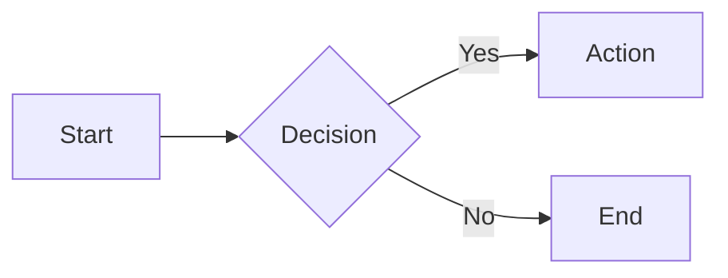

## Goldmark Extensions

All [Goldmark](https://github.com/yuin/goldmark) extensions are enabled:

| Extension        | Syntax                               |
| ---------------- | ------------------------------------ |
| Tables           | Standard GFM pipe-delimited tables   |
| Strikethrough    | `~~deleted~~`                        |
| Task lists       | `- [ ]` / `- [x]`                    |
| Definition lists | Term followed by `: definition`      |
| Footnotes        | `[^1]` with `[^1]: text`             |
| Auto headings    | Slugged heading IDs for anchor links |
| Linkify          | Bare URLs auto-linked                |
| Typographer      | Smart quotes, dashes, ellipses       |

## Syntax Highlighting

[Chroma](https://github.com/alecthomas/chroma) with Monokai theme supports 200+ languages:

````markdown
```go
func main() {
    fmt.Println("Hello, World!")
}
```
````

Rendering happens server-side. No client-side JavaScript needed for highlighting.

## Diagrams

### D2 (Server-Side SVG)

[D2](https://d2lang.com/) diagrams are compiled to SVG at render time:

````markdown
```d2
x -> y: hello
y -> z: world
```
````

### Mermaid (Client-Side)

[Mermaid](https://mermaid.js.org/) diagrams load the library on-demand — only when a page contains a mermaid block:

````markdown

````

## Admonition Blocks

GitHub-style callout blocks using blockquote syntax:

```markdown
> [!NOTE]
> Useful information that users should be aware of.

> [!WARNING]
> Critical content that needs extra attention.
```

Six alert types with distinct colors:

| Type        | Color       | Use case                     |
| ----------- | ----------- | ---------------------------- |
| `NOTE`      | Blue        | Informational notes          |
| `TIP`       | Green       | Helpful suggestions          |
| `IMPORTANT` | Purple      | Key information              |
| `WARNING`   | Amber       | Cautionary advice            |
| `CAUTION`   | Red         | Potential risks              |
| `CRITICAL`  | Intense red | Urgent/essential information |

## Frontmatter

YAML metadata at the top of each file:

```yaml
---
title: "Page Title"
description: "Page description"
author: "Author Name"
tags: ["go", "markdown"]
draft: false
---
```

Files with `draft: true` are excluded from the site.

## Table of Contents

Auto-generated from headings (h2+) with:

- Hierarchical nesting (parent/child items)
- URL-friendly anchor links
- Sidebar navigation in the file view

## Reading Time

Estimated at 200 words per minute, displayed in the article header.
